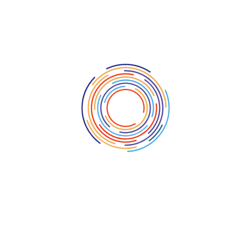

# SPEC'TRUM

## 🖥️ 프로젝트 소개

- `p5.js`를 이용하여, 이용자가 자폐 스펙트럼 장애인들이 겪는 감각 과부하를 시청각적으로 체험하는 것을 목적으로 개발된 시리어스 컨텐츠이자 프로그램입니다.
- 서울대학교 언론정보학부 `정보문화기술입문` 수업의 2023년도 1학기 Term Project로써 제작되었습니다.

## 🧑🏼‍🚀 멤버 구성

- 정해인(자유전공 21, 팀장)
- 박준영(전기정보 17)
- 김영찬(자유전공 17)
- 장순주(언론정보 21)

## 🗓️ 제작 기간

2023년 5월 16일 ~ 2023년 6월 16일

## 🎯 기획 의도 및 목표

많은 자폐인들은 평소에는 비장애인들과 비슷한 수준의 감각 및 지각 기능을 가지고 있으나, 외부의 강력한 자극이나 정신적인 스트레스를 받는 상황에 놓이게 되면 **감각 과부하**라 불리는 현상을 겪게 됩니다.

이러한 시청각적 감각 과부하 현상을 비장애인들이 체험할 수 있도록 함으로써, 자폐인들이 느끼는 세상은 어떤지 비장애인들에게 알림과 동시에 이를 간접적으로나마 경험하고 공감할 수 있도록 하고자 본 프로그램을 개발하게 되었습니다.

## 📌 주요 기능

### Intro

- 자폐 스펙트럼 장애에 대한 간략한 설명
- 기획 의도 명시
- 3가지의 상황 옵션을 제시하여 이용자가 선택
  - 카페에서 음료를 주문하는 상황
  - 친했던 친구와 오랜만에 길에서 마주친 상황
  - 어린 아이가 교내에서 길을 물어보는 상황

### Sensory Overload Simulation

- 2분할 화면으로 구성
  - 대화 상대와 유저 본인의 모습을 동시에 확인 가능
- 정해진 시간이 지나면 감각 과부하 시뮬레이션 시작
  - 시작 전 안내 문구 출력

### Outro

- 팀원 소개

## 🎮 시연 방법

위 로고를 클릭하면 프로그램을 시연할 수 있는 웹사이트로 이동됩니다.
